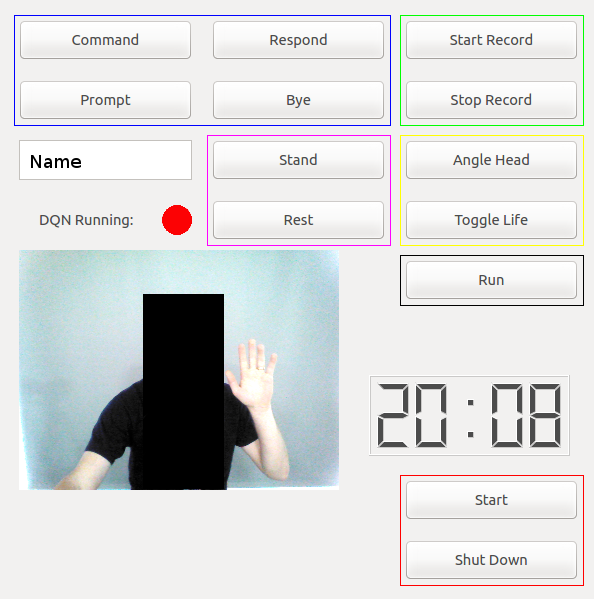

# Deep Reinforcement Learning of Abstract Reasoning from Demonstrations (deep_reinforcement_abstract_lfd)
Madison Clark-Turner

The following repository contains a Deep Recurrent Q-Network (DRQN) architecture for the learning high-level human interactions from demonstrations (LfD). We specifically designed this network for use with an Applied Behavioral Analysis (ABA) styled social greeting behavioral intervention (BI). Our system collects demonstrations of the BI using a tele-operated robot and then extracts relevant features of the interaction in order to perform the intervention autonomously. The DRQN structure was designed using Tensorflow and integrated on a NAO humanoid robot using ROS. For the purposes of privacy we have excluded the raw demonstartion data but include the tools to generate additional demonstration files.

A description of our implementation along with both simulated results and live-system results are currently under review for presentation in [HRI 2018](http://humanrobotinteraction.org/2018/). 

Installation
=============

Once the dependencies have been installed download the contents of the GitHub repository into your "~/catkin_ws/src" directory. In addition to the files located in the repository you will also need to download the InceptionResNetV2.ckpt file from the given link in order to use the provided software. Move the checkpoint file to "~/catkin_ws/src/deep_reinforcement_abstract_lfd/src/dqn/." or an equivalent directory. 

Finally run the following command to generate storage directories
```
mkdir ~/bag ~/tfrecords ~/tfrecords/train ~/tfrecords/test
```

Usage
=============

Usage of the system occurs in three steps:
-Collection of training data using a tele-operated robot as it delivers the desired BI
-Learning of the BI via the DRQN
-Execution of the learned BI using an autonomous system

Our implementation is designed for use with a social greeting BI. Which proceeds in the following manner:
1. The therapist/robot delivers a *Discriminitive Stimuli* (The robot says "hello" and waves)
2. The participant provides a *response* that is either compliant (responding to the robot) or non-compliant (refusing to acknowledge the robot's command)
3. The robot reacts to the participants response:
   - Compliant: the robot delivers a *reward* congratulating the participant on following the intervention. The BI then continues to step 
   - Non-compliant: the robot delivers a *prompt* instructing the participant to responsd in a compliant manner (saying "<Participant>, say hello" and waving). The BI then returns to step 2 or if several prompts have failed to elicit a compliant response then the BI proceeds tho step 4.
4. The robot ends the BI by saying "Good Bye"
 
Data Collection
--------------------

Data collection is performed using a tele-operated NAO humanoid robot. Demonstrations are first recorded as Rosbags and then later converted into TFRecords for training in the DRQN.

Operating the robot can be perfromed using our provided interface. The interface can be openned using the following commands in seperate terminals

```
roslaunch nao_bringup nao_full_py.launch
roslaunch deep_reinforcement_abstract_lfd interface.launch
```


  
The following buttons perfom the following operations:

System Functions
- **Start:** Places the robot into a position it can deliever the BI and stiffens the robot's joints.
- **Shut Down:** Closes the robot interface and ends listening ROS topics

Action Functions
- **Command:** delivers the *Discriminitive Stimuli* (SD)
- **Prompt:** executes the *Prompt* (PMT) action
- **Reward:** executes the *Reward* (REW) action
- **Abort:** executes the *End Session* (END) action

Recording Functions
- **Start Record:** starts recording observations of the BI
- **Stop Record:** stops recording observations of the BI and outputs the generated rosbag to the "~/bag" directory

Stance Functions
- **Stand:** places the robot in a standing stance
- **Rest:** places the robot in a resting/crouching stance

Utility Functions
- **Angle Head:** angles the robot's head down so that the camera is focused on the participant
- **Toggle Life:** disables autonomus life

Autonomous Functions
- **Run:** has the robot deliver the learned BI autonomously.

When delivering the SD and PMT the robot will greet the participant by the name listed in the textbox. A live feed of what the robot observes is displayed in the interface and a clock displaying the current time (minutes and seconds) is provided for operations that require timing on the part of the system operator. When the system is initially started the "DQN Running" indicator will be red and the 'Run' button will be disabled. Once the DRQN has initalized its variables and is functioning the DQN indicator will turn green and the 'Run' button will be enabled. 

To record training examples begin by selecting 'Start Record', then perform the desired function (e.g. the SD action followed by an observation period of several seconds, the REW action, and then the END action). Once the entire interaction has been observed select the 'Stop Record' button to generate a rosbag file (extension .bag) in the "~/bag" directory described in the installation instructions.

Once a collection of rosbag demonstrations have been recorded the files can be converted to TFRecords using

```
python generate_tfrecord_from_rosbag.py
```

Training the DRQN
--------------------

To train the DRQN using we must need to first alter several inputs in a parameter file. Inside 'src/dqn/params_file.txt' are several parameters that influcence our model generation. 

- CHECKPOINT_DIRECTORY = a prefix for the name of the directory in which to save the DRQN's internal values. If the directory does not exist the model will generate a new directory. If the directory does exist then the contents of the directory will be overwritten.
- CHECKPOINT_NAME = the name for the checkpoint file to be saved
- RESTORE_CHECKPOINT = the directory and name of the checkpoint file to be restored. If left blank the network will use randomized values to initialize the DRQN. When first training the network this option should be left blank.
- LOG_DIR = A directory to store information about the DRQN network (most of this functionality is currently disabled)
- TRAIN_DIR = the directory containing the TFRecord demonstrations to train the system. The path is relative to the current directory.
- TEST_DIR = the directory containing the TFRecord demonstrations to evaluate the system. The path is relative to the current directory.

When first training the network make sure that CHECKPOINT_DIRECTORY, CHECKPOINT_NAME, and TRAIN_DIR are defined and that RESTORE_CHECKPOINT is left blank. Then execute

```
python model_trainer.py
```

The trainer will begin optimizing the network and will output timing information every iteration. The accuracy of the model on the test set will be printed every 10 iterations and the values of the model will be saved to the listed checkpoint file every 1,000 iterations. EVery 10,000 iterations the heckpoint_directory will change befre the finalized network values will be output in the directory suffixed by "_final"

Once the network has trained the system can be evaluated by defining TEST_DIR and setting RESTORE_CHECKPOINT to list the directory and checkpoint name described when training the model. Executing 

```
python evaluator.py
```

provides simulated results of the system's accuracy.

Execution of Autonomous System
--------------------

The automated system an then be run on the robot using the same commands listed in the "Data Collection" section. Once the interface is open and the "DQN Running" indicator is lit the automated system can be executed by either selecting the 'Run' button or by pressing the NAO's left foot bumper.

Dependencies
=============
The following libraries are used by this application:
- [Tensorflow 1.3.0](https://www.tensorflow.org/) - Deep network library
- [NumPy 1.13.3](http://www.numpy.org/), [SciPy 0.19.1](http://www.scipy.org/) - Python numerical libraries
- [OpenCV2 2.4.8](https://opencv.org/) - Open Source image processing library
- [Librosa 0.5.1](https://librosa.github.io/librosa/index.html) - Music and audio analysis library
- [ROS Indigo](http://wiki.ros.org/) - (Robot Operating System) Robotics library

Acknowledgents
=============

We borrowed code from several sources for this project:

- Spectral Subtraction: https://github.com/tracek/Ornithokrites.git
- Inception Network: https://github.com/tensorflow/models.git
